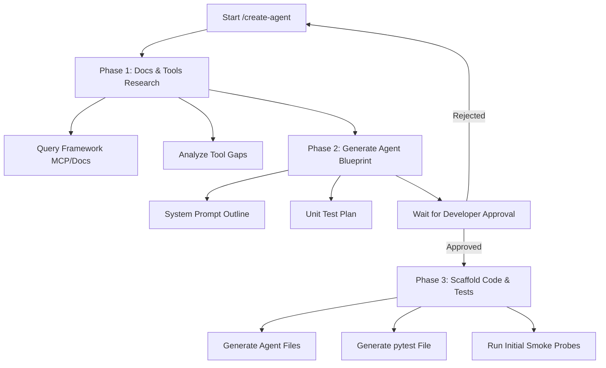
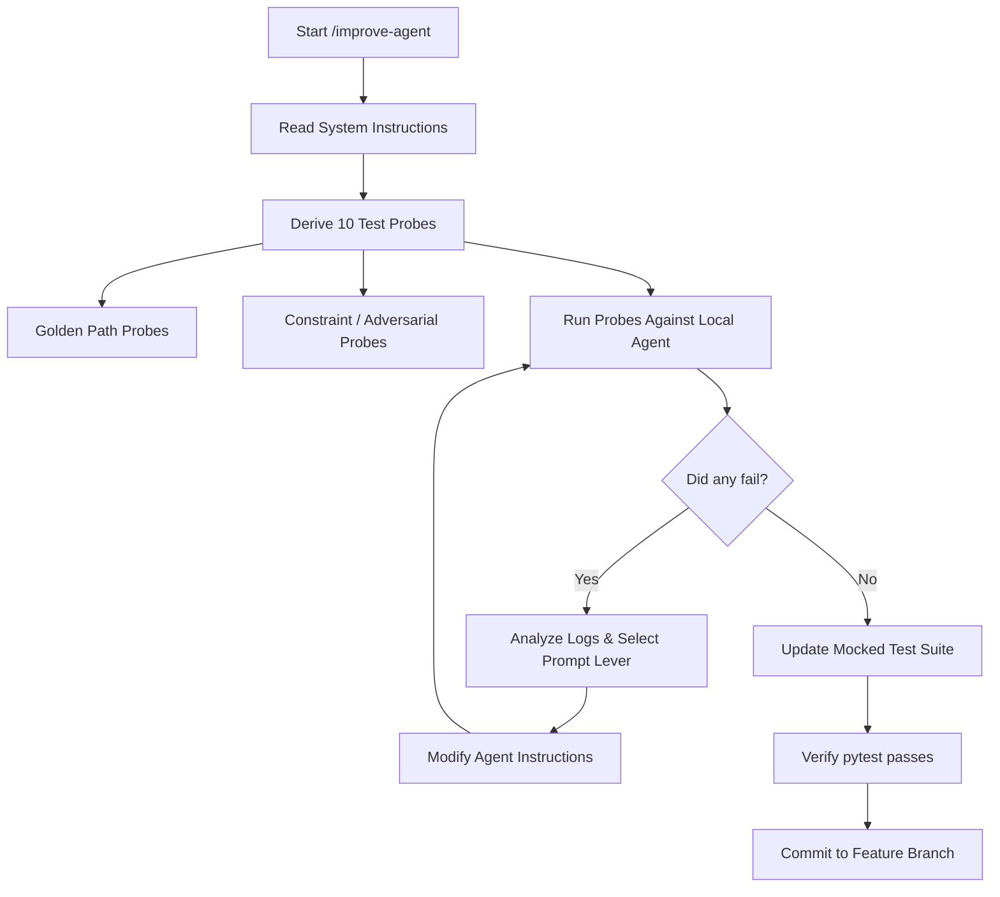

# 🚀 Quickstart Guide: Recursive Agentic Improvements

Welcome! This guide is designed to get you up and running with **Recursive Agentic Improvements** in under 5 minutes. Even if you have never built an AI agent before, this guide will take you step-by-step from zero to launching and improving production-grade agents.

---

## 🎨 Project Overview & Architecture

To help you visualize how this repository fits into your development workflow, here is a conceptual diagram of the **Recursive Agentic Self-Improvement Loop**:


This repository provides Claude Code **skills** (slash commands) that you install into your own python projects. These skills empower Claude Code to act as an expert agent engineer, automating the research, scaffolding, testing, and optimization of agents.

---

## 🧠 AI Agent Engineering 101 (For Beginners)

Before we start coding, let's break down the core concepts of agentic systems into plain English:

| Term | What it is | Real-World Analogy |
|---|---|---|
| **AI Agent** | An LLM configured with a specific role, instructions, and tools to accomplish tasks autonomously. | A specialized virtual employee. |
| **System Prompt (Instructions)** | The core blueprint, rules of behavior, goals, and constraints given to the agent. | A detailed employee handbook. |
| **Tools (Functions)** | Python functions the agent can decide to run to fetch data, perform calculations, or interact with external APIs. | A computer with internet access and calculators. |
| **State & Memory** | The ability to remember past messages or facts within or across sessions. | A notepad to write down client details during a conversation. |
| **Mock-Based Testing** | Running tests with predefined mock model outputs instead of calling expensive live LLM APIs. | A flight simulator to test a pilot before letting them fly a real plane. |

---

## 🔄 How the Skills Work

Here is how the custom Claude Code commands manage your agent lifecycle:

### 1. The /create-agent Pipeline (Research ➔ Plan ➔ Scaffold)


### 2. The /improve-agent Loop (Recursive Self-Correction)


---

## ⚡ 5-Minute Installation & Setup

### Step 1: Install the Skills into Your Project
Navigate to your project directory and run the installer via `npx` (Node.js and npm required, no other prerequisites):

**Claude Code** (default):
```bash
npx github:cloudbloqavi/recursive-agentic-improvements
```

**Other agentic AI environments** — use the `--agent` flag:
```bash
npx github:cloudbloqavi/recursive-agentic-improvements --agent cursor       # Cursor → .cursor/rules/
npx github:cloudbloqavi/recursive-agentic-improvements --agent copilot      # GitHub Copilot → .github/instructions/
npx github:cloudbloqavi/recursive-agentic-improvements --agent roo          # Roo Code → .roo/rules/
npx github:cloudbloqavi/recursive-agentic-improvements --agent windsurf     # Windsurf → .windsurf/rules/
npx github:cloudbloqavi/recursive-agentic-improvements --agent codex        # OpenAI Codex → project root
npx github:cloudbloqavi/recursive-agentic-improvements --agent antigravity  # Google Antigravity → .agents/rules/
```

The installer creates the target directory if it doesn't exist, then copies the three skills (`create-agent.md`, `improve-agent.md`, `extend-agent.md`) and `TEST_CONSTITUTION.md` into your `tests/` directory.

### Step 2: Configure Environment Variables
Copy the `.env.example` file to `.env` and fill in your API keys:

```bash
cp .env.example .env
```

Ensure you set:
- `ANTHROPIC_API_KEY` (or `OPENAI_API_KEY` / `GOOGLE_API_KEY`)

### Step 3: Set Up MCP Documentation Servers (Highly Recommended)
To allow Claude Code to inspect the latest framework documentation live, add the MCP servers to your global config (`~/.claude/settings.json`) or project config (`.claude/settings.json`):

```json
{
  "mcpServers": {
    "agno-docs": {
      "type": "http",
      "url": "https://docs.agno.com/mcp"
    },
    "langchain-docs": {
      "type": "http",
      "url": "https://docs.langchain.com/mcp"
    },
    "crewai-docs": {
      "type": "http",
      "url": "https://docs.crewai.com/mcp"
    }
  }
}
```
*Restart Claude Code after saving the config.*

---

## 🎮 Real-World Sandbox Scenarios

This repository contains static reference showcases in the `tests/` directory. Let's play with them to understand how each agentic framework works under the hood.

> [!TIP]
> Before running any sandbox script, install its dependencies. We recommend using the `uv` toolchain with `uv sync --extra <framework>` which automatically sets up a virtual environment and installs the requested packages.

### 📊 Scenario 1 (Agno) — The Calculator Agent
* **Where it is:** [tests/agno/](tests/agno/)
* **What it does:** Uses a custom `add_numbers` tool, remembers past calculations, and declines off-topic questions.
* **Run the Agent:**
  ```bash
  uv sync --extra agno
  uv run pytest tests/agno/
  ```

### 👥 Scenario 2 (CrewAI) — Research & Writing Crew
* **Where it is:** [tests/crewai/](tests/crewai/)
* **What it does:** Orchestrates a Senior Research Analyst agent and a Content Writer agent to research any topic and write a concise summary.
* **Run the Agent:**
  ```bash
  uv sync --extra crewai
  uv run pytest tests/crewai/
  ```

### 🔗 Scenario 3 (LangGraph) — ReAct Agent
* **Where it is:** [tests/langgraph/](tests/langgraph/)
* **What it does:** Builds a stateful ReAct graph that registers a multiplication tool and persists conversation state with memory checkpointers.
* **Run the Agent:**
  ```bash
  uv sync --extra langgraph
  uv run pytest tests/langgraph/
  ```

### 🌤️ Scenario 4 (Google ADK) — Weather Agent
* **Where it is:** [tests/google_adk/](tests/google_adk/)
* **What it does:** Demarcates Google ADK structural agent syntax (`root_agent` export) and binds custom tools like `fetch_weather`.
* **Run the Agent:**
  ```bash
  uv sync --extra google-adk
  uv run pytest tests/google_adk/
  ```

---

## 🛠️ Onboarding Checklist for Junior Developers

When you are ready to write or contribute to agents in this project, follow this simple checklist:

- [ ] **Research first:** Always run live search queries to check if the framework has updated its class structures.
- [ ] **Define clear rules:** Make sure your agent's system prompt has explicit constraints ("What You Must NOT Do").
- [ ] **Write Mocked Tests:** Always add static properties validation and behavioral assertions using mock responses to `tests/test_<slug>.py`.
- [ ] **Run pytest:** Keep the unit test suite clean and green by running `pytest tests/` before opening a pull request.
- [ ] **Git branching:** Create a feature branch (e.g. `agent/my-agent`) and commit surgical changes using conventional commit style.

---

## 💡 Need Help?
- Check the [Test Constitution](tests/TEST_CONSTITUTION.md) for testing guidelines.
- Ask Claude Code in the chat or type `/goal` if you want it to run automated agent development tasks end-to-end!
