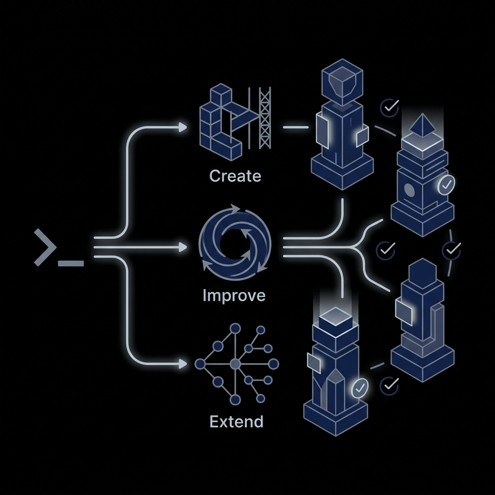

# 🚀 Recursive Agentic Improvements

> 🔗 **[Live Landing Page](https://cloudbloqavi.github.io/recursive-agentic-improvements/)**
>
> **New to AI Agent engineering?** Get started immediately with our step-by-step **[Quickstart Guide (5-Minute Path)](QUICKSTART.md)**.

---

## 🎨 Project Overview & Architecture

This repository contains Claude Code **skills** (custom slash commands) that automate the creation, testing, and recursive optimization of AI agents across Agno, CrewAI, LangGraph, and Google ADK.



---

## 📂 Repository Index & Roadmap

This project is organized to separate the Claude Code skills, reference guides, and mock-based showcases. Use this map to navigate the codebase:

| Document | Purpose | Path |
|---|---|---|
| **Quickstart Guide** | 5-minute setup, core terminology, and sandbox walkthroughs. | [QUICKSTART.md](QUICKSTART.md) |
| **Testing Constitution** | Standard for writing offline, mock-based unit tests for agents. | [TEST_CONSTITUTION.md](tests/TEST_CONSTITUTION.md) |
| **Showcase Guidelines** | Running and testing sandbox agents for each framework. | [Showcase README](tests/README.md) |
| **Contributor Guidelines** | Developer instructions and testing protocol. | [CLAUDE.md](CLAUDE.md) |
| **License** | MIT License terms. | [LICENSE](LICENSE) |

---

## 🛠️ Claude Code Skills (Slash Commands)

These skills are self-contained markdown documents under [.claude/commands/](.claude/commands/). Once installed, you can run them directly in your project:

| Skill Command | Core Function | Blueprint File |
|---|---|---|
| `/create-agent` | Scaffolds a new agent from scratch by researching live docs and planning structure. | [create-agent.md](.claude/commands/create-agent.md) |
| `/improve-agent` | Recursively executes behavioral probes, analyzes logs, and refines prompts. | [improve-agent.md](.claude/commands/improve-agent.md) |
| `/extend-agent` | Adds new tools or capabilities safely to an existing agent's configuration. | [extend-agent.md](.claude/commands/extend-agent.md) |

---

## ⚡ Quick Install

You can install these skills (and the standard testing configurations) directly into your target project directory using `npx`:

### Option A — Direct from GitHub (Recommended)
Run this command from inside your target project directory:
```bash
npx github:cloudbloqavi/recursive-agentic-improvements
```

### Option B — Local Installer
If you have cloned this repository locally, execute:
```bash
npx ./installer /path/to/your-agentic-project
```

*For manual copy instructions, please see [QUICKSTART.md](QUICKSTART.md#step-1-install-the-skills-into-your-project).*

---

## 📖 Framework Documentation Index

The `docs/` directory contains framework-agnostic entry points and specific guides that drive the skills. Use these files to reference syntax and architecture patterns:

*   **Universal Runbooks**:
    *   [Universal Create Runbook](docs/create-new-agent.md)
    *   [Universal Improve Runbook](docs/improve-agent.md)
    *   [Universal Extend Runbook](docs/extend-agent.md)

*   **Framework-Specific Directories**:
    *   **Agno**: [Chatbot](docs/agno/chatbot/create-new-agent.md) · [Research Assistant](docs/agno/research-assistant/create-new-agent.md)
    *   **CrewAI**: [Content Pipeline](docs/crewai/content-pipeline/create-new-agent.md) · [Research Crew](docs/crewai/research-crew/create-new-agent.md)
    *   **LangGraph**: [ReAct Agent](docs/langgraph/react-agent/create-new-agent.md) · [Multi-Agent Supervisor](docs/langgraph/multi-agent-supervisor/create-new-agent.md)
    *   **Google ADK**: [Chatbot](docs/google-adk/chatbot/create-new-agent.md) · [Tool-Using Agent](docs/google-adk/tool-using-agent/create-new-agent.md)

---

## 🎯 Design Principles

*   **Research Before Code**: Skills query live documentation via MCP servers or search APIs to identify native tools and imports before generating files.
*   **Blueprint Gatekeeping**: All operations generate a detailed blueprint that requires explicit developer confirmation before executing disk writes.
*   **The Spec is the Source of Truth**: Agent behavioral probe suites are dynamically derived from the agent's prompt/system instructions (`INSTRUCTIONS`), verifying promises directly.
*   **Determinism by Default**: Evaluation layers use mocked models (`GenericFakeChatModel` or unittest mocks) to run offline-friendly, fast, and key-free test suites.

---

## 💡 Support & Contribution

If you want to contribute framework templates or improvements, please review the rules in [CLAUDE.md](CLAUDE.md) first. For testing guidelines, refer to the [Test Constitution](tests/TEST_CONSTITUTION.md).
