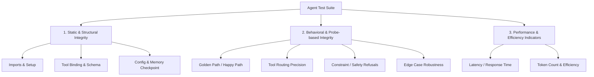

# Agent Test Constitution & Standard Evaluation Framework

This document establishes the official standard for writing, structuring, and running test cases for AI agents in this repository. All test files across all supported frameworks (**Agno**, **CrewAI**, **LangGraph**, and **Google ADK**) must adhere to these guidelines.

---

## 1. Core Testing Philosophy

Agent testing is divided into three distinct evaluation layers to ensure code correctness, routing reliability, and behavioral alignment:



### Mocking vs. Live Execution
*   **Default Mode (Unit/CI):** All pytest suites **MUST use mocked LLM responses** (either using framework-native fake models or `unittest.mock` patching). This prevents non-deterministic failures, reduces latency, and removes dependency on API keys.
*   **Integration Mode (E2E):** Real LLM calls should be run separately (e.g. nightly or on-demand) and must be marked with `@pytest.mark.live`.

---

## 2. Evaluation Parameters & Criteria

Every agent test suite must test the agent against these standard parameters:

### A. Static / Structural Integrity
Tests must verify the configuration and declaration of the agent object *before* any LLM calls are executed:
*   **Properties Assertions:** Validate `name`, `description`, `model_name` (or ID), and framework settings.
*   **Tool Schema Registry:** Verify that expected tool functions are registered and check the tools' parameter types and docstrings.
*   **Memory/Checkpointer Bindings:** Ensure checkpointers (e.g. `MemorySaver`, storage DBs) are instantiated correctly.

### B. Behavioral (Probe-based) Integrity
Tests must simulate user interactions and verify agent responses. Using mocked LLM responses, we test the agent's deterministic parsing and routing logic:
*   **Golden Path (Happy Path):** Assert that a standard user query receives a structured, context-appropriate response.
*   **Tool Routing Precision:** Ensure specific queries trigger tool calls with the expected parameter structures.
*   **Constraint / Refusal Safeguards:** Test negative constraints (e.g., that the agent refuses prompt injections, rejects out-of-domain requests, or refuses to leak its instructions).
*   **Edge Case Robustness:** Test behavior on boundary inputs (empty messages, extremely long context, or type mismatches).

### C. Performance & Efficiency Indicators
Tests must verify token counters and execution stats:
*   **Latency Check:** Tracking time to response.
*   **Token efficiency:** Monitoring prompt and completion token counts to alert on bloated contexts.

---

## 3. Mocking Recipes by Framework

To enforce offline determinism, use the following framework-specific mocking patterns:

### Agno
Mocking `agent.run()` or patching `OpenAIChat.response` or `Claude.response` to return a predefined response structure:
```python
from unittest.mock import patch, MagicMock
from agno.run.agent import RunOutput

def test_agno_happy_path():
    mock_response = RunOutput(content="Mocked calculator output is 42", messages=[])
    with patch("agno.agent.Agent.run", return_value=mock_response):
        response = agent.run("What is 15 + 27?")
        assert "42" in response.content
```

### CrewAI
CrewAI relies on LangChain's chat models under the hood. Patch the `_generate` or `invoke` method of the underlying model class:
```python
from unittest.mock import patch, MagicMock
from langchain_core.outputs import ChatResult, ChatGeneration
from langchain_core.messages import AIMessage

def test_crewai_happy_path():
    mock_msg = AIMessage(content="Final Answer: This is a mocked research summary about AI.")
    mock_result = ChatResult(generations=[ChatGeneration(message=mock_msg)])
    with patch("langchain_openai.ChatOpenAI._generate", return_value=mock_result):
        # Kick off crew
```

### LangGraph
Use LangChain's built-in `GenericFakeChatModel` to script exact sequence responses (text/tool calls):
```python
from langchain_community.chat_models import GenericFakeChatModel
from langchain_core.messages import AIMessage

def test_langgraph_happy_path():
    fake_llm = GenericFakeChatModel(
        messages=[
            AIMessage(content="Routing to tools...", additional_kwargs={"tool_calls": [...]}),
            AIMessage(content="The product of 12 and 9 is 108.")
        ]
    )
    # Instantiate or patch graph with fake_llm
```

### Google ADK
Google ADK uses the `google-genai` client. Patch the async client's generation methods:
```python
from unittest.mock import AsyncMock, patch

async def test_adk_happy_path():
    with patch("google.genai.Client") as mock_client:
        mock_client.aio.chats.send_message = AsyncMock(return_value=...)
        # Execute Runner
```

---

## 4. Pytest Standards

*   **Test File Naming:** Must follow `test_<framework_name>.py`.
*   **Fixtures:** Use `pytest` fixtures for agent/graph setups (in `tests/conftest.py` or locally).
*   **Custom Markers:** Categorize tests using standard decorators:
    *   `@pytest.mark.static`: For static structure and configuration tests.
    *   `@pytest.mark.behavioral`: For behavioral, routing, and constraint tests using mocks.
    *   `@pytest.mark.live`: For end-to-end tests executing real model calls (disabled in CI).
